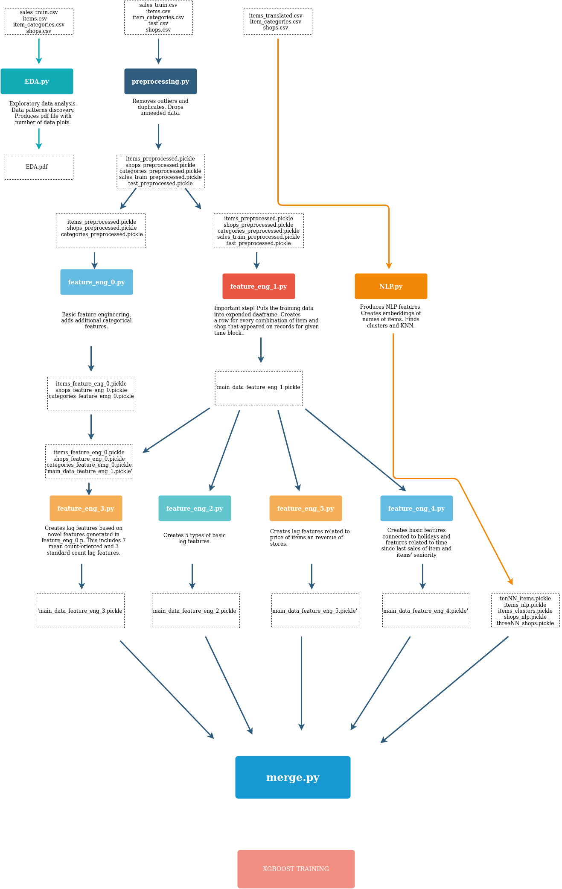

# Predict Future Sales Workflow

Authors: George Papadimitriou, Patrycja Krawczuk, Tu Mai Anh Do, Ewa Deelman

This workflow is based on Predict Future Sales kaggle competition (https://www.kaggle.com/c/competitive-data-science-predict-future-sales) and it's capable of producing a score of ~0.88.

## Dependencies

## File Description

## How To Run The Workflow
```
python3 workflow_generator.py
bash plan.sh workflow.yml
```

## Available Generation Options
```
python3 workflow_generator.py -h
-----------------------------------------------------------------------------
usage: workflow_generator.py [-h] [--max_cores INT] [--xgb_trials INT]
                             [--xgb_early_stopping INT]
                             [--xgb_tree_method STR] [--xgb_feat_len INT INT]
                             [--monitoring] [--output_single] [--singularity]
                             [--output STR]

Pegasus Workflow for Kaggle's Future Sales Predictiong Competition

optional arguments:
  -h, --help            show this help message and exit
  --max_cores INT       Max cores that can be allocated
  --xgb_trials INT      Max trials for XGBoost hyperparameter tuning
  --xgb_early_stopping INT
                        XGBoost early stopping rounds
  --xgb_tree_method STR
                        XGBoost hist type: ['hist', 'gpu_hist']
  --xgb_feat_len INT INT
                        Train XGBoost by including features between [LEN_MIN,
                        LEN_MAX], LEN_MIN>=5
  --monitoring          Enable Panorama Monitoring
  --output_single       Output Pegasus configuration in a single yaml file
  --singularity         Use Singularity instead of Docker
  --output STR          Output file
```

## Example Usage With Options
```
python3 workflow_generator.py --max_cores 8 --xgb_trials 10 --xgb_early_stopping 20 --xgb_tree_method gpu_hist --singularity
bash plan.sh workflow.yml
```



